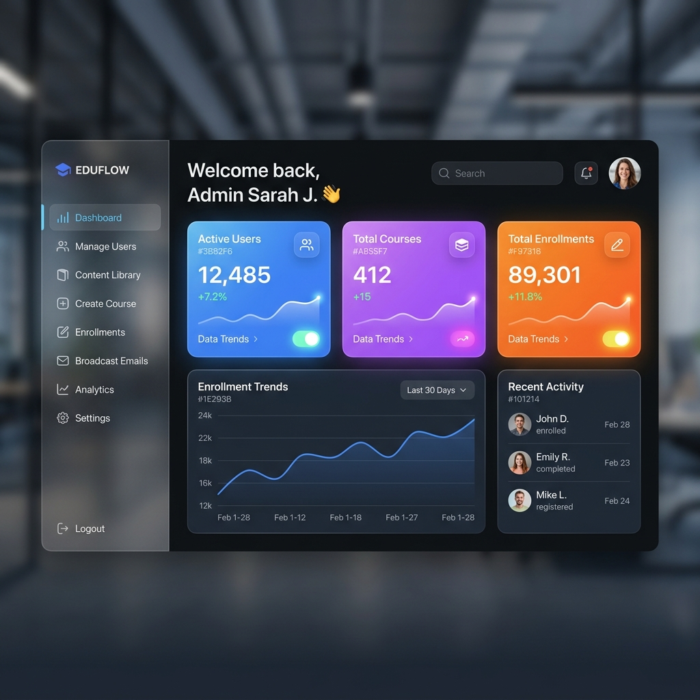
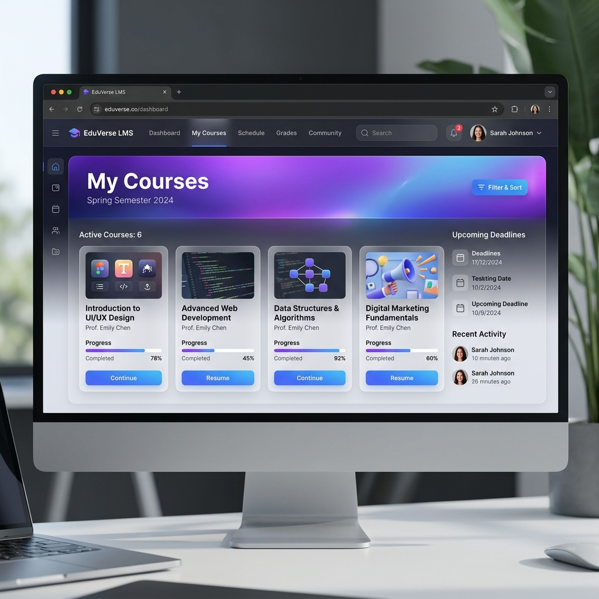
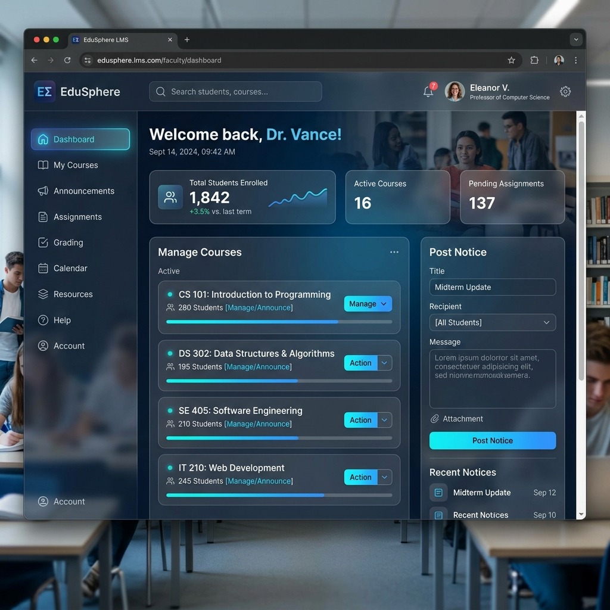

# 📚 Learning Management System (LMS)

> A full-featured, role-based Learning Management System built with **Spring Boot**, **JSP**, **MySQL**, and **Bootstrap**. Designed for Students, Faculty, and Administrators.

---

## 🚀 Tech Stack

| Layer | Technology |
|---|---|
| Backend | Java 17, Spring Boot 3.x |
| Frontend | JSP, Bootstrap 5, Bootstrap Icons, Chart.js |
| Database | MySQL 8 |
| Security | Spring Security (role-based) |
| Build Tool | Maven |
| Server | Embedded Tomcat (Spring Boot) |

---

## ✨ New Features & How They Work

### 1. Spring Data JPA Layer
We modernized the entire data access layer, moving from fragile native JDBC statements to a robust **Spring Data JPA** architecture using Hibernate.
- **How it works:** Core components such as `User`, `Course`, `Notice`, and `Enrollment` are defined as `@Entity` classes mapping directly to MySQL tables. `UserRepository` and other interfaces extend `JpaRepository`, automatically generating database operations. To handle case-insensitive dashboard metrics, we rely on Spring's powerful query derivation logic (e.g., `findByRoleIgnoreCase()`), completely avoiding explicit SQL strings while boosting performance and type safety.

### 2. Live Admin Dashboard & Mass Broadcasting
The Administrator interface was completely redesigned to be extremely dynamic.
- **Admin Metrics Control Panel:** The `AdminController` calculates real-time platform statistics—like percentage bounds for enrolled students vs active faculty—and dynamically injects them into the glassmorphic UI. 
- **Broadcast Email System:** Built on JavaMailSender (`BroadcastController`), admins can dispatch highly customized Rich-HTML broadcast emails directly to filtered cohorts (e.g., exclusively 'Students' or 'Faculty'). These executions are off-loaded to asynchronous threads and recorded immutably in a `broadcast-log.jsp` datatable for historical tracking.



### 3. Interactive Student & Faculty Portals
The user-facing portals evolved into complete Single Page Application (SPA)-like experiences. 
- **Student Course Progress:** Students can view visual progress bars tracking their course completion rate. When a video/lesson finishes, an async call updates the state in the backend, refilling their progress bar dynamically.
- **Faculty Hub:** Instructors have a powerful interface to grade submissions and dispatch real-time global notifications that are immediately visible on the Student's navigation bell icon.




### 4. Comprehensive Unit & Integration Testing
We established a robust testing framework to ensure application reliability.
- **Unit Tests:** Using Mockito, we isolated the business logic (`EmailService`, controllers) from the database layer, allowing us to test edge cases rapidly.
- **Integration Tests:** Leveraging `MockMvc` and `@DataJpaTest`, we rigorously tested the API endpoints, ensuring role-based access control works as intended (e.g., stopping unauthorized users from accessing the `/adashboard` path).

---

## 👥 Roles & Features

### 🎓 Student
- View enrolled courses and track progress
- Submit and view assignments
- Browse notices and announcements
- View personal profile
- Access premium content
- Global search across courses

### 👨‍🏫 Faculty
- Manage and post assignments
- View student submissions
- Access faculty dashboard
- Post course material

### 🛡️ Admin
- Full control panel (Admin Dashboard)
- User management (create, edit, delete users)
- Post notices and announcements
- Monitor server status
- Restricted access portal

---

## 🗂️ Project Structure

```
lms/
├── src/
│   ├── main/
│   │   ├── java/com/lms/
│   │   │   ├── controller/       # Spring MVC Controllers
│   │   │   ├── model/            # Entity classes
│   │   │   ├── repository/       # JPA Repositories
│   │   │   ├── service/          # Business logic
│   │   │   └── config/           # Security & App config
│   │   ├── resources/
│   │   │   └── application.properties
│   │   └── webapp/
│   │       ├── views/            # JSP pages
│   │       ├── css/              # Bootstrap & custom CSS
│   │       ├── js/               # JavaScript files
│   │       └── image/            # Static images
├── pom.xml
└── README.md
```

---

## ⚙️ Setup & Installation

### Prerequisites
- Java 17+
- Maven 3.8+
- MySQL 8+
- Git

### 1. Clone the Repository
```bash
git clone https://github.com/Abinash330/Learning-Management-System.git
cd Learning-Management-System
```

### 2. Configure the Database
Create a MySQL database:
```sql
CREATE DATABASE lmsdb;
```

Update `src/main/resources/application.properties`:
```properties
spring.datasource.url=jdbc:mysql://localhost:3306/lmsdb
spring.datasource.username=your_mysql_username
spring.datasource.password=your_mysql_password
spring.jpa.hibernate.ddl-auto=update
```

### 3. Run the Application
```bash
mvn spring-boot:run
```

The app will be available at: **http://localhost:8080**

---

## 🔐 Default Login Credentials

| Role | Email | Password |
|---|---|---|
| Admin | admin@lms.com | admin123 |
| Faculty | faculty@lms.com | faculty123 |
| Student | student@lms.com | student123 |

> ⚠️ Change these credentials immediately in production!

---

## 🔄 Application Workflow

```
User visits /login
      │
      ├──► Admin   ──► /adashboard  (User Mgmt, Notices, Control Panel)
      │
      ├──► Faculty ──► /fdashboard  (Assignments, Course Material)
      │
      └──► Student ──► /sdashboard  (Courses, Progress, Assignments)
```

1. **Authentication** — Spring Security handles login with role-based redirection
2. **Admin** creates users, posts notices, manages the system
3. **Faculty** posts assignments and course content
4. **Students** enroll, submit assignments, and track progress

---

## 📄 Key Pages

| URL | Description |
|---|---|
| `/` | Home / Landing page |
| `/login` | Login page (all roles) |
| `/register` | New account registration |
| `/adashboard` | Admin control panel |
| `/fdashboard` | Faculty dashboard |
| `/sdashboard` | Student dashboard |
| `/users` | Admin — User management |
| `/addnotice` | Admin — Post notices |
| `/s-courses` | Student — Browse courses |
| `/s-assignments` | Student — View/submit assignments |
| `/contact` | Contact / Support page |

---

## 🤝 How to Contribute

1. **Fork** this repository
2. **Create** a new branch
   ```bash
   git checkout -b feature/your-feature-name
   ```
3. **Make** your changes and commit
   ```bash
   git commit -m "feat: describe your change"
   ```
4. **Push** to your fork
   ```bash
   git push origin feature/your-feature-name
   ```
5. Open a **Pull Request** on GitHub

### Commit Message Convention
| Prefix | Purpose |
|---|---|
| `feat:` | New feature |
| `fix:` | Bug fix |
| `style:` | UI / CSS changes |
| `refactor:` | Code restructuring |
| `docs:` | Documentation update |

---

## 🐛 Reporting Issues

If you find a bug or have a feature request:
1. Go to the [Issues tab](https://github.com/Abinash330/Learning-Management-System/issues)
2. Click **New Issue**
3. Describe the problem clearly with steps to reproduce

---

## 📬 Contact & Support

| | |
|---|---|
| **Developer** | Abinash |
| **Email** | abinashkar019@gmail.com |
| **GitHub** | [@Abinash330](https://github.com/Abinash330) |

---

## 📜 License

This project is licensed under the **MIT License** — feel free to use and modify it for educational purposes.

---

> ⭐ If you found this project helpful, please give it a **star** on GitHub!
