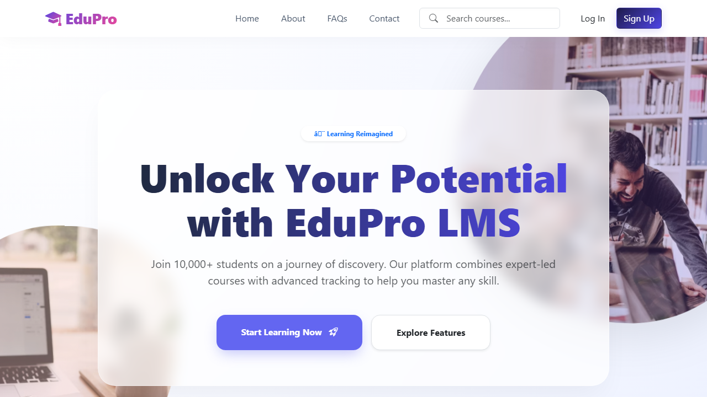
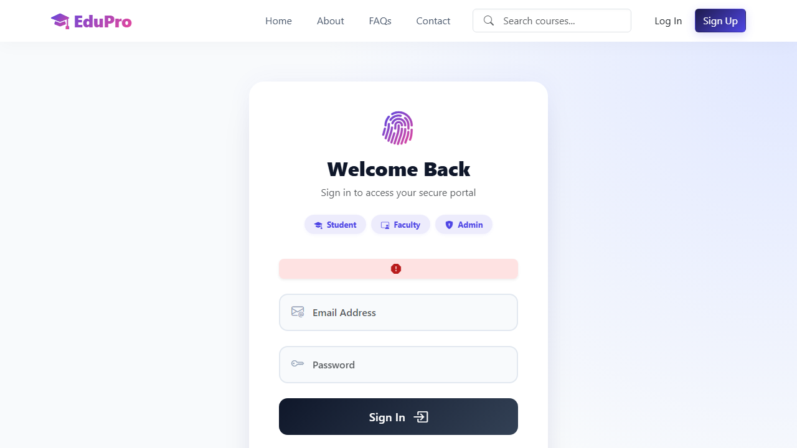
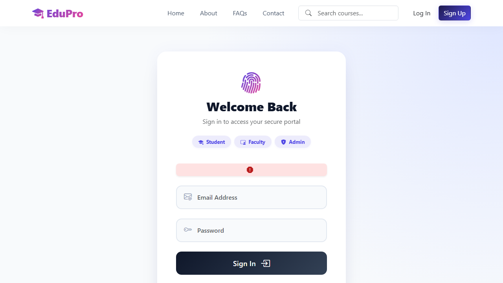
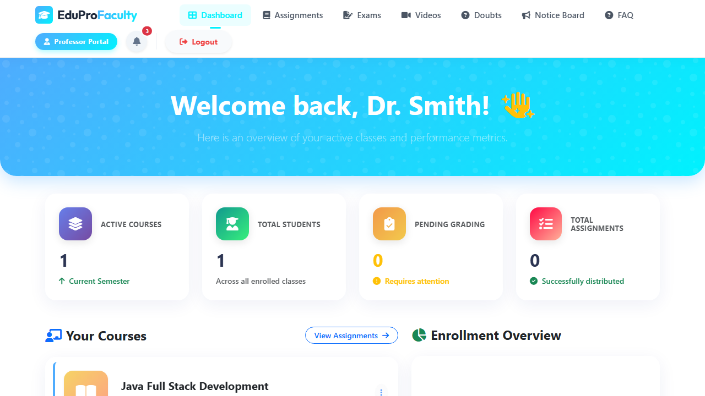
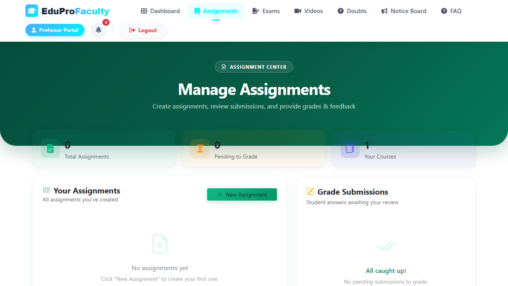
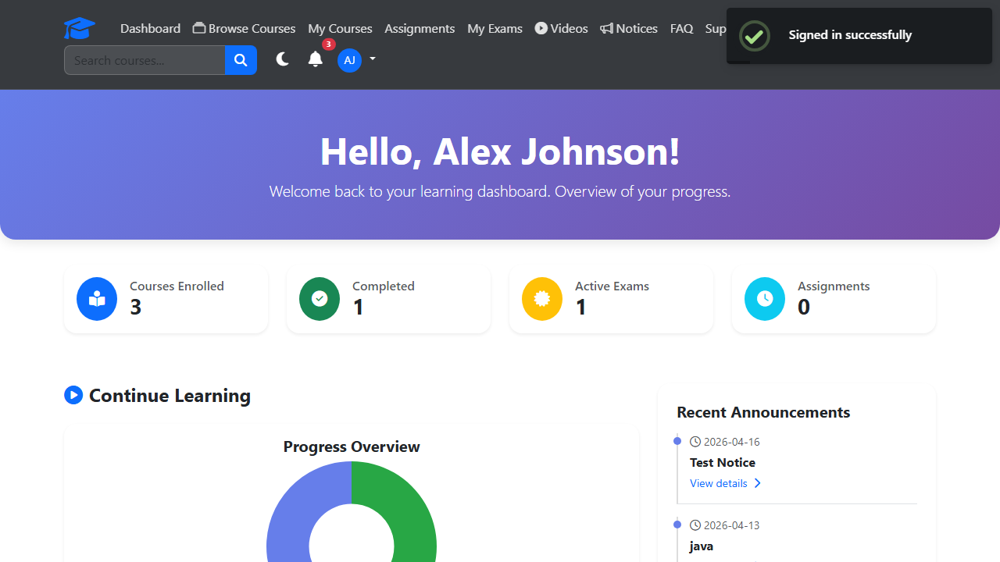
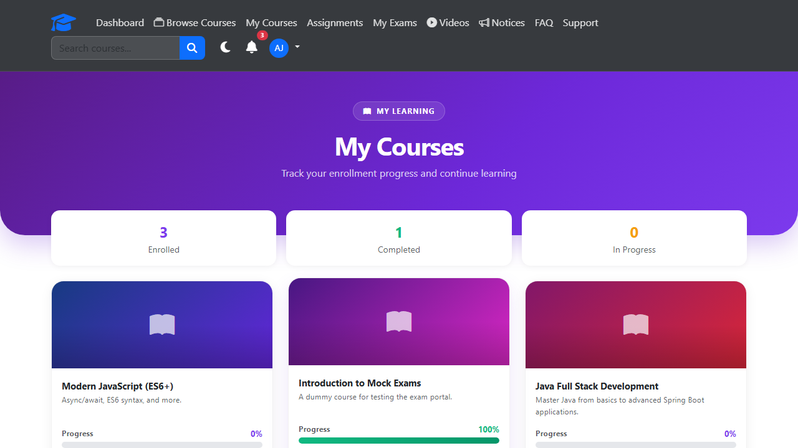
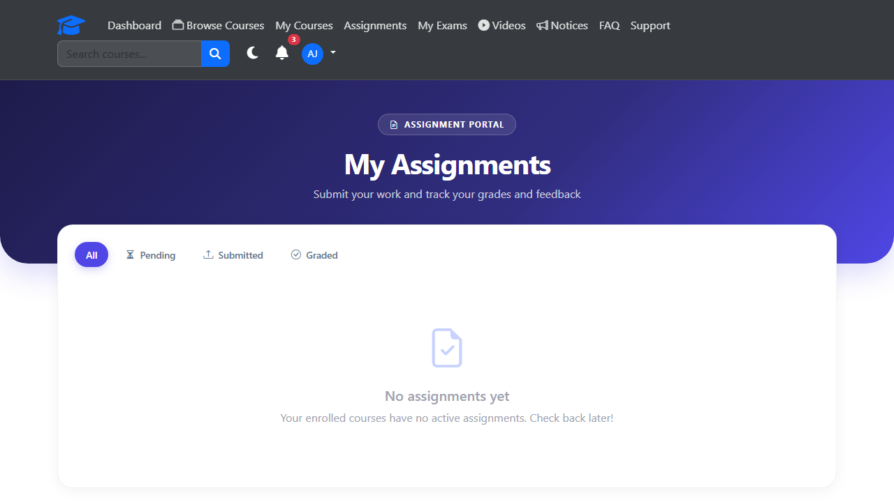
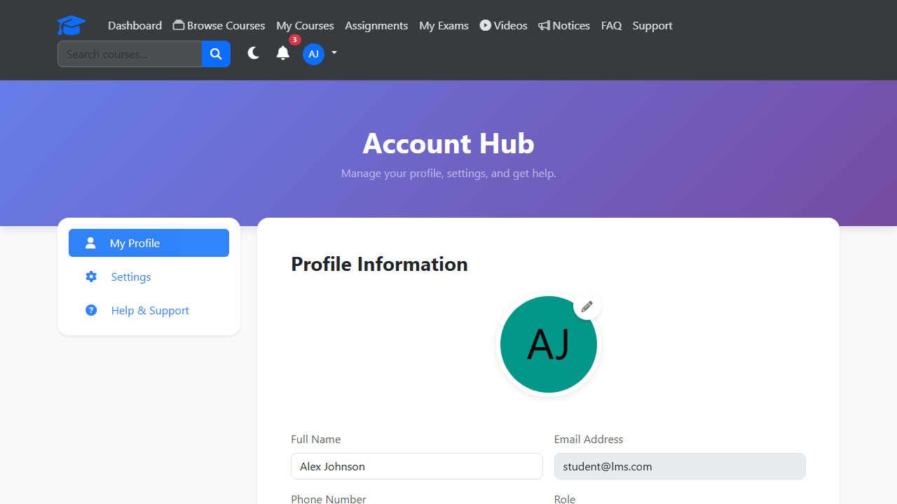

# 📚 Learning Management System (LMS)

[](https://spring.io/projects/spring-boot)
[](https://www.oracle.com/java/)
[](https://www.mysql.com/)
[](https://spring.io/projects/spring-security)
[](https://getbootstrap.com/)
[](LICENSE)

> A full-featured, enterprise-grade, role-based **Learning Management System** engineered with **Spring Boot**, **Spring Data JPA**, **MySQL 8**, **Spring Security**, and modern **Bootstrap 5**. Designed for seamless academic orchestration across **Students**, **Faculty**, and **Administrators**.

---

## 📑 Table of Contents
1. [Overview & Core Highlights](#-overview--core-highlights)
2. [Master Technical Documentation (PDF)](#-master-technical-documentation-pdf)
3. [System Architecture](#-system-architecture)
4. [Role-Based Feature Matrix](#-role-based-feature-matrix)
5. [Visual UI Showcase](#-visual-ui-showcase)
6. [Database Schema & JPA Entities](#-database-schema--jpa-entities)
7. [API & Controller Routing Directory](#-api--controller-routing-directory)
8. [Setup & Installation Guide](#-setup--installation-guide)
9. [Default Login Credentials](#-default-login-credentials)
10. [Project Directory Layout](#-project-directory-layout)
11. [License & Author](#-license--author)

---

## 🌟 Overview & Core Highlights

The **Learning Management System (LMS)** delivers a unified academic environment that connects institutional leaders, educators, and learners into a unified digital campus:

- 🛡️ **Administrator Command Hub:** Executive KPI analytics, user activation governance (Pending $\to$ Active workflow), multi-channel notice board, department/course catalog management, and asynchronous mass Rich-HTML email broadcasting.
- 👨‍🏫 **Faculty Course & Assessment Hub:** High-definition video lecture streaming uploads (up to 500MB), assignment management with student submission grading, real-time student doubt forum, and timed MCQ examination authoring.
- 🎓 **Student Learning Suite:** Interactive course enrollment, video playback with automated progress tracking, homework submission portal, doubt ticket escalation, and real-time timed online examinations with instant scoring.
- 🔒 **Enterprise-Grade Security:** Role-Based Access Control (RBAC), session status checks, active user presence tracking (`isOnline` toggles), and secure parameter handling.

---

## 📄 Master Technical Documentation (PDF)

A complete architectural and functional whitepaper is available in the repository:
- 📥 **[Download Master LMS Technical Documentation (PDF)](LMS_Project_Comprehensive_Documentation.pdf)**

---

## 🏗️ System Architecture

The application is structured into decoupled architectural tiers to ensure maintainability, scalability, and security:

```
┌─────────────────────────────────────────────────────────────────────────┐
│                           Client Web Browser                            │
│                 (Bootstrap 5, JSTL, Chart.js, HTML5/CSS3)               │
└────────────────────────────────────┬────────────────────────────────────┘
                                     │ HTTP (Port 8081)
┌────────────────────────────────────▼────────────────────────────────────┐
│                       Spring Security & Filter Chain                    │
│                 (Role-Based Access Control: Admin / Faculty / Student)  │
└────────────────────────────────────┬────────────────────────────────────┘
                                     │
┌────────────────────────────────────▼────────────────────────────────────┐
│                          Spring MVC Controllers                         │
│  AdminController | FacultyController | StudentController | Broadcast..  │
└──────────────────┬───────────────────────────────────┬──────────────────┘
                   │                                   │
┌──────────────────▼──────────────────┐   ┌────────────▼──────────────────┐
│        Business Service Layer       │   │     Asynchronous Mailing      │
│  VideoService | Custom Services     │   │  JavaMailSender (@Async Queue)│
└──────────────────┬──────────────────┘   └───────────────────────────────┘
                   │
┌──────────────────▼──────────────────────────────────────────────────────┐
│                  Spring Data JPA & Hibernate 7 ORM                      │
│      17 Entity Models | Derived Queries | HikariCP Connection Pool      │
└──────────────────┬──────────────────────────────────────────────────────┘
                   │ JDBC / SQL
┌──────────────────▼──────────────────────────────────────────────────────┐
│                         MySQL 8.0 Database                              │
│              (InnoDB Engine, UTF-8, Relational Integrity)               │
└─────────────────────────────────────────────────────────────────────────┘
```

---

## 👥 Role-Based Feature Matrix

### 1. 🛡️ Administrator Module (`/adashboard`)
- **Live Metrics Dashboard:** Real-time metrics visualizing total users, active faculty, enrolled students, active courses, pending doubts, and server health.
- **User Lifecycle Governance (`/users`):** Complete user administration with role modification, deletion, and one-click account activation toggle (`status: 0 ↔ 1`).
- **Institutional Notices (`/addnotice`):** Publish notices targeted to `All`, `Student`, or `Faculty` with support for document attachments.
- **Mass Email Broadcast System (`/admin/broadcast`):** Dispatch Rich-HTML broadcast emails to segmented cohorts. Processed asynchronously in background worker threads with an immutable log history (`broadcast-log.jsp`).
- **Academic Oversight:** Create and supervise academic departments, courses, faculty lecture uploads, and live online exams.

### 2. 👨‍🏫 Faculty Module (`/fdashboard`)
- **Instructor Dashboard:** Summarizes active courses, enrolled student counts, pending assignment submissions, and quick action cards.
- **Video Lecture Hub (`/faculty/videos`):** Multipart video upload (up to 500MB) with title, duration, chapter description, and streaming capabilities.
- **Assignment Management (`/f-assignments`):** Author homework briefs with deadlines and max points; review uploaded student solution files, award scores, and submit remarks.
- **Interactive Doubt Forum (`/faculty/doubts`):** Dedicated Q&A interface to answer course-related student inquiries.
- **Exam Authoring Suite (`/faculty/exams`):** Create timed MCQ exams, specify time limits and passing criteria, and author questions with multiple options and answer keys.

### 3. 🎓 Student Portal (`/sdashboard`)
- **Learner Dashboard:** Overview of enrolled courses, upcoming deadlines, exam alerts, recent notices, and dynamic course completion progress bars.
- **Course Catalog & Enrollment (`/s-courses`):** Explore academic offerings by department and enroll with a single click.
- **Video Learning Suite (`/s-watch`):** Chapter-indexed video streaming with auto-updating progress calculation.
- **Assignment Submissions (`/s-assignments`):** Download assignment briefs, submit solution documents, and track awarded grades and feedback.
- **Doubt Helpdesk:** Submit questions linked to specific courses and receive direct instructor responses.
- **Online Examination Portal (`/student/exams`):** Take timed exams with a countdown timer, dynamic question navigation, instant automatic score calculation, and post-exam answer review.
- **Profile Management (`/s-profile`):** View academic record, update contact details, and change security credentials.

---

## 📸 Visual UI Showcase

### 1. Landing & Authentication
| Landing Page (`/` or `/index`) | Authentication Portal (`/login`) |
|:---:|:---:|
|  |  |
| *Hero section with statistics and course teasers* | *Secure login with role-based routing and status checks* |

---

### 2. Administrator Hub
| Admin Analytics Dashboard (`/adashboard`) | User Lifecycle Management (`/users`) |
|:---:|:---:|
|  |  |
| *Live KPI metrics and control panel* | *User directory with instant account activation toggles* |

| Notice Board Dispatcher (`/addnotice`) | Mass Email Broadcast Engine (`/admin/broadcast`) |
|:---:|:---:|
|  |  |
| *Multi-audience announcement authoring with file uploads* | *Rich-HTML email broadcast with asynchronous worker* |

---

### 3. Faculty Academic Portal
| Faculty Control Center (`/fdashboard`) | Assignment & Grading Hub (`/f-assignments`) |
|:---:|:---:|
|  |  |
| *Instructor overview of courses and learners* | *Assignment authoring and student submission grading* |

---

### 4. Student Learning Center
| Personalized Student Hub (`/sdashboard`) | Course Catalog & Video Streaming (`/s-courses`) |
|:---:|:---:|
|  |  |
| *Progress trackers, deadline reminders, and alerts* | *Chapter-based video lecture player and enrollment* |

| Assignment Submissions (`/s-assignments`) | Student Profile & Settings (`/s-profile`) |
|:---:|:---:|
|  |  |
| *File upload submission and grade reports* | *Contact info, password change, and activity logs* |


---

## 🗄️ Database Schema & JPA Entities

The system uses **Spring Data JPA** with **Hibernate 7** mapped to MySQL 8:

| Entity | Primary Key | Key Attributes | Relationship / Description |
|---|---|---|---|
| **User** | `id` (INT) | `name`, `email` (Unique), `mobile`, `password`, `role`, `status`, `isOnline` | Core user identity & authentication |
| **Course** | `id` (INT) | `title`, `code`, `description`, `department`, `duration`, `facultyName` | Academic courses mapped to departments |
| **Department** | `id` (INT) | `name`, `code`, `description`, `headOfDepartment` | Institutional department organization |
| **VideoLecture**| `id` (INT) | `title`, `videoUrl`, `videoFileName`, `durationMinutes`, `courseId` | Course video content (1:M with Course) |
| **Enrollment** | `id` (INT) | `studentEmail`, `studentName`, `courseId`, `courseName`, `progressPercent`| Student course registration & progress |
| **Assignment** | `id` (INT) | `title`, `description`, `courseId`, `dueDate`, `maxMarks`, `attachmentPath`| Faculty assignment briefs |
| **AssignmentSubmission** | `id` (INT) | `assignmentId`, `studentEmail`, `filePath`, `marksAwarded`, `feedback`, `status` | Student homework submissions & grades |
| **Notice** | `id` (INT) | `title`, `content`, `targetRole`, `priority`, `attachmentPath`, `postedBy` | Multi-audience institutional notices |
| **Doubt** | `id` (INT) | `studentEmail`, `courseId`, `question`, `answer`, `status`, `answeredBy` | Q&A doubt resolution threads |
| **Exam** | `id` (INT) | `title`, `courseId`, `durationMinutes`, `totalMarks`, `passMarks`, `status` | Timed online examinations |
| **Question** | `id` (INT) | `examId`, `questionText`, `marks`, `questionType` | Multi-choice exam questions |
| **Option** | `id` (INT) | `questionId`, `optionText`, `isCorrect` | Choices for exam questions |
| **ExamResult** | `id` (INT) | `examId`, `studentEmail`, `score`, `totalMarks`, `percentage`, `status` | Auto-calculated examination scorecards |
| **StudentAnswer**| `id` (INT)| `examResultId`, `questionId`, `selectedOptionId`, `isCorrect` | Individual question response logs |
| **BroadcastLog**| `id` (INT) | `subject`, `recipientCount`, `targetRole`, `senderEmail`, `sentAt`, `status`| Asynchronous email broadcast audit log |
| **FAQ** | `id` (INT) | `question`, `answer`, `category`, `role` | Dynamic institutional FAQ knowledgebase |
| **Contact** | `id` (INT) | `name`, `email`, `mobile`, `subject`, `message`, `submittedAt` | Public visitor inquiries |

---

## 🛣️ API & Controller Routing Directory

| HTTP Method | Endpoint Path | Controller | Access Level | Description |
|---|---|---|---|---|
| `GET` | `/` or `/index` | `AnoController` | Public | Home landing page with course highlights |
| `GET` | `/login` | `AnoController` | Public | Authentication login view |
| `POST` | `/login` | `AnoController` | Public | Verifies credentials, checks activation status, sets session |
| `GET` | `/register` | `AnoController` | Public | Registration page for new users |
| `POST` | `/register` | `AnoController` | Public | Saves user record with pending `status=0` |
| `GET` | `/logout` | `AnoController` | Authenticated | Clears `isOnline`, destroys session, redirects to `/login` |
| `GET` | `/adashboard` | `AdminController` | Admin | Admin control panel with calculated metrics |
| `GET` | `/users` | `AdminController` | Admin | User management directory with activation toggle |
| `GET` | `/edituser/{id}` | `AdminController` | Admin | Renders edit user form |
| `POST` | `/edituser` | `AdminController` | Admin | Updates user information and role assignment |
| `GET` | `/deleteuser/{id}` | `AdminController` | Admin | Removes user from database |
| `GET` | `/addnotice` | `AdminController` | Admin | Notice creation view with file attachment |
| `POST` | `/addnotice` | `AdminController` | Admin | Persists and broadcasts new notice |
| `GET` | `/admin/broadcast` | `BroadcastController` | Admin | Rich-HTML mass email broadcasting form |
| `POST` | `/admin/broadcast/send` | `BroadcastController` | Admin | Dispatches asynchronous email queue |
| `GET` | `/fdashboard` | `FacultyController` | Faculty | Faculty dashboard with courses and submissions |
| `GET` | `/faculty/videos` | `VideoController` | Faculty | Video lecture management portal |
| `POST` | `/faculty/videos/upload` | `VideoController` | Faculty | Handles multipart lecture upload (up to 500MB) |
| `GET` | `/f-assignments` | `FacultyController` | Faculty | Assignment creation and grading view |
| `POST` | `/faculty/grade-submission` | `FacultyController` | Faculty | Saves grade and remarks for student submission |
| `GET` | `/sdashboard` | `StudentController` | Student | Student personalized dashboard |
| `GET` | `/s-courses` | `StudentController` | Student | Course catalog and enrolled courses |
| `GET` | `/s-watch` | `StudentController` | Student | Video player with dynamic progress tracking |
| `GET` | `/s-assignments` | `StudentController` | Student | Assignment download and submission portal |
| `GET` | `/student/exams` | `StudentExamController` | Student | Timed examination portal |
| `POST` | `/student/exam/submit` | `StudentExamController` | Student | Evaluates exam answers and returns score review |
| `GET` | `/faq` | `AnoController` | Public | Role-filtered FAQ knowledgebase |
| `POST` | `/contact` | `AnoController` | Public | Saves public contact inquiry |

---

## ⚙️ Setup & Installation Guide

### Prerequisites
- **Java:** JDK 17 or higher (tested with Oracle JDK 24)
- **Database:** MySQL 8.0+
- **Build Tool:** Apache Maven 3.8+ (or bundled `mvnw`)

### 1. Database Setup
Launch MySQL and create the database:
```sql
CREATE DATABASE lms;
```

### 2. Configure `application.properties`
Update `src/main/resources/application.properties` with your database credentials and mail settings:
```properties
server.port=8081
spring.mvc.view.prefix=/views/
spring.mvc.view.suffix=.jsp

# MySQL Connection
spring.datasource.url=jdbc:mysql://localhost:3306/lms
spring.datasource.username=root
spring.datasource.password=YOUR_MYSQL_PASSWORD

# Hibernate DDL
spring.jpa.hibernate.ddl-auto=update
spring.jpa.show-sql=true

# Broadcast Email (Gmail SMTP)
spring.mail.host=smtp.gmail.com
spring.mail.port=587
spring.mail.username=your_email@gmail.com
spring.mail.password=your_app_password
spring.mail.properties.mail.smtp.auth=true
spring.mail.properties.mail.smtp.starttls.enable=true

# File Upload Limit
spring.servlet.multipart.max-file-size=500MB
spring.servlet.multipart.max-request-size=510MB
```

### 3. Build and Run
```powershell
# Compile the application
.\mvnw.cmd clean compile

# Start the Spring Boot application
.\mvnw.cmd spring-boot:run
```

Once initialized, open your browser and navigate to:
👉 **[http://localhost:8081](http://localhost:8081)**

---

## 🔐 Default Login Credentials

| Role | Email | Password | Direct Dashboard URL |
|---|---|---|---|
| **Admin** | `admin@lms.com` | `admin123` | [http://localhost:8081/adashboard](http://localhost:8081/adashboard) |
| **Faculty** | `faculty@lms.com` | `faculty123` | [http://localhost:8081/fdashboard](http://localhost:8081/fdashboard) |
| **Student** | `student@lms.com` | `student123` | [http://localhost:8081/sdashboard](http://localhost:8081/sdashboard) |

> 💡 *Note: New accounts registered through the `/register` page will have `status=0` (Pending) and must be approved by the Admin in `/users` before logging in.*

---

## 📂 Project Directory Layout

```
lms/
├── assets/
│   └── images/                                 # Visual assets & UI screenshots
│       ├── screenshots/                        # 01_landing_page.png ... 12_student_profile.png
│       ├── admin_dashboard.png
│       ├── faculty_dashboard.png
│       └── student_dashboard.png
├── src/
│   ├── main/
│   │   ├── java/com/example/lms/
│   │   │   ├── LmsApplication.java             # Spring Boot Main Entrypoint
│   │   │   ├── component/                      # Data seeders & startup components
│   │   │   ├── config/                         # Security & database configuration
│   │   │   ├── controller/                     # Spring MVC & REST Controllers
│   │   │   ├── model/                          # 17 JPA Entity Definitions
│   │   │   ├── repository/                     # 17 Spring Data JPA Repositories
│   │   │   └── service/                        # Email & Video business services
│   │   ├── resources/
│   │   │   └── application.properties          # Server, DB, Mail, Multipart config
│   │   └── webapp/
│   │       ├── views/                          # JSP pages & UI views
│   │       ├── css/                            # Bootstrap & custom styling
│   │       ├── js/                             # Interactive scripts
│   │       └── image/                          # Static branding images
├── LMS_Project_Comprehensive_Documentation.pdf  # Master Whitepaper PDF
├── pom.xml                                     # Maven Dependencies & Build Configuration
└── README.md                                   # Comprehensive Repository Documentation
```

---

## 📜 License & Author

- **Developer:** Abinash Kar
- **License:** Licensed under the [MIT License](LICENSE).
- **Academic Citation:** Designed and built for academic and institutional excellence.
